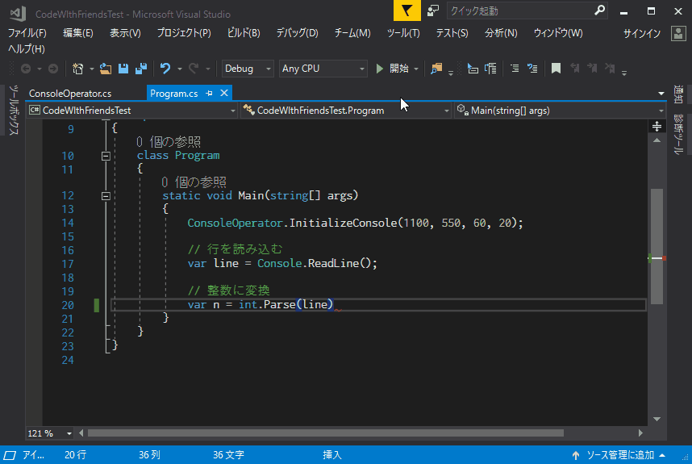

# Code with Kemono Friends

## なにこれなにこれー！
開発中にフレンズが話しかけてくれるVisual Studio 2017の拡張機能です。  
ビルドに成功・失敗した時、デバッグモードで未補足の例外が発生した時にフレンズから通知が届きます。  

## どうやってつかうのー？
[こちら](https://github.com/xirtardauq/code-with-kemono-friends/releases)から最新バージョンのインストーラ（CodeWithKemonoFriends.vsix）をダウンロードして、お使いのVisual Studioにインストールしてください。  
インストール後、メニューバーのツールから「フレンズを呼ぶ」を選択すると機能が有効になります。  

なお、この拡張機能は以下の環境でのみ動作します。  

- Windows 10
- Visual Studio 2017

## つくったー！？
- Takumi Yamada (xirtardauq@gmail.com)